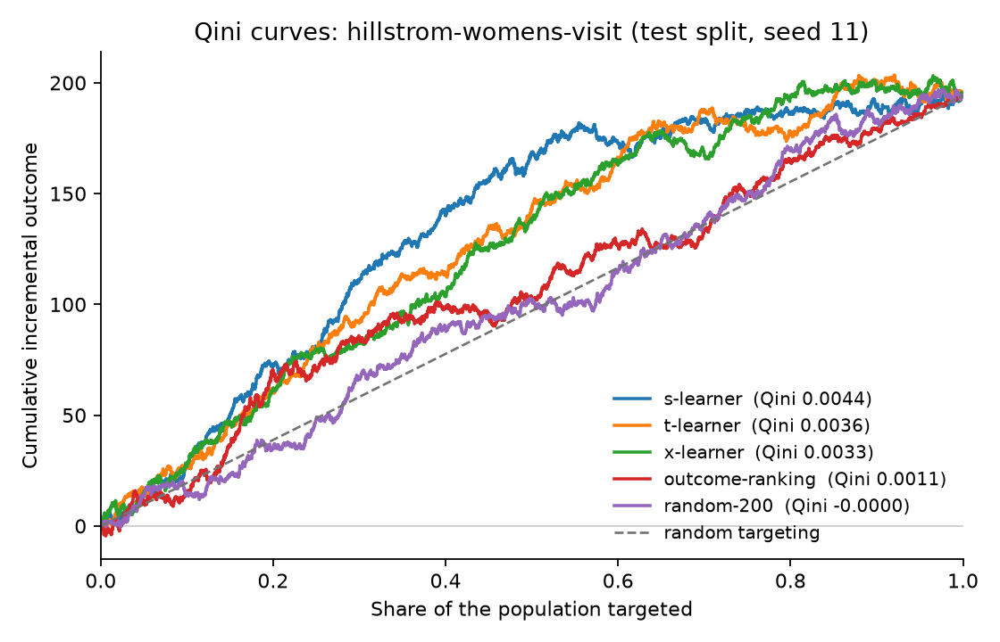
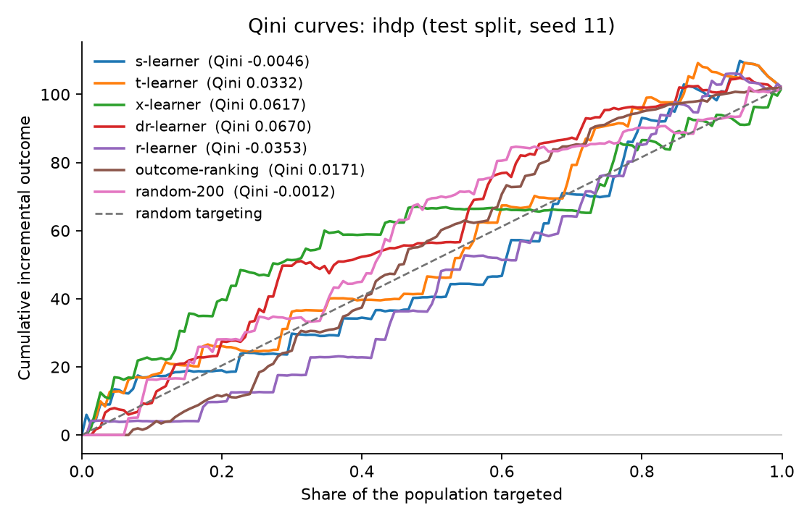
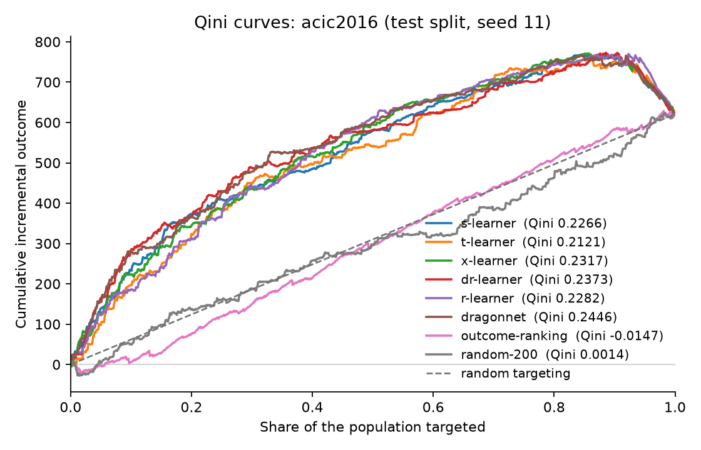
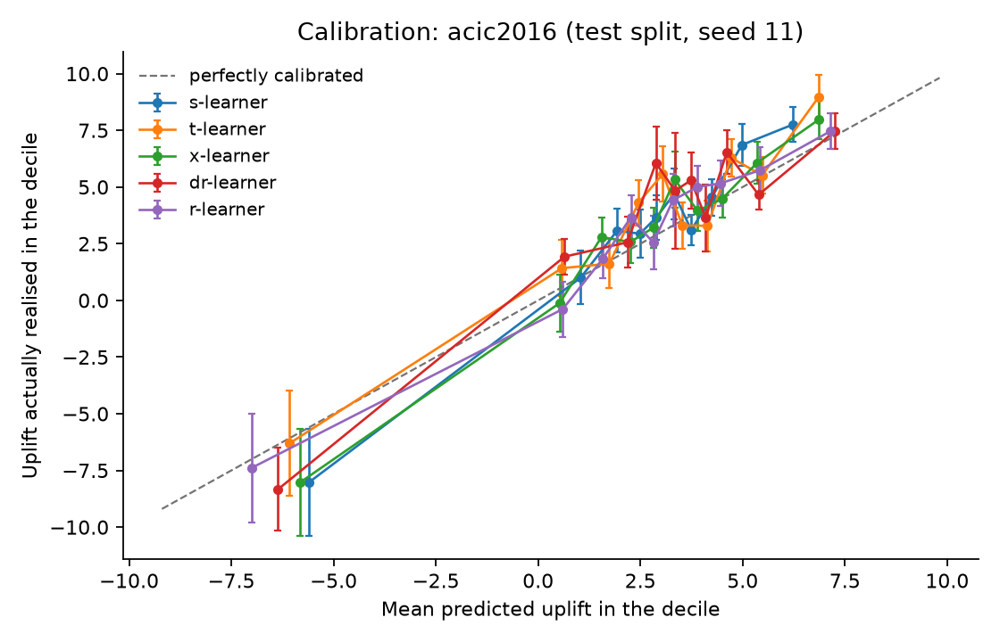

# Intervention Targeting Engine

Tells an organisation which customers, cases or patients to spend a limited intervention
budget on: only the ones whose outcome the intervention actually changes. Retention
offers, outreach, fraud review, clinical follow-up: a large share of every such budget
goes to people who would have behaved the same way regardless, and this finds them, and
shows the intervention list changing as the budget moves.

**Status: week 7 of 8.** Seven estimators benchmarked on all five datasets, each reported with
what its ranking actually buys at a budget rather than only how well it ranks, plus a
sensitivity section, a fraud worked case that declares itself semi-synthetic in its first
sentence, and a budget-slider demo that is built and not yet hosted. The numbers below are real
and reproducible. Still to come: hosting, `docs/rejected.md`, the clean-environment rerun, and
the flip to public. Build plan: [PLAN.md](PLAN.md).

**The same baseline, the same code, opposite conclusions.** Ranking people by risk is how this
job is usually done. At a budget covering a tenth of the population it buys **-0.20 on ACIC**
and **+0.0055 on Criteo**, against random targeting's +0.26 and +0.0008. On ACIC it is worse
than spending nothing at all, interval entirely below zero. On Criteo it matches every uplift
model in this repository and beats random targeting sevenfold. On Hillstrom it is worth nothing
over a coin flip at a tight budget and recovers about a third of the gap by a wide one. On
Lenta nothing separates from random, including the uplift models.

So risk ranking is not a trap and it is not safe: it is one or the other depending on the data,
the difference is worth a change of sign, and nobody can guess which case they are in. Anybody
can measure it. `uv run itx diagnose --dataset <name>` decides it for the price of one outcome
model, before any of the rest of this is worth running.

## Results

Every table on this page is written by `uv run itx benchmark --dataset <name>` and is
never edited by hand. Each number is the mean across five committed split seeds, with the
95% bootstrap interval alongside it. Hyperparameters are chosen per seed on a validation
split from a grid that is identical for every estimator, and the test split is never
touched until the numbers below are computed. There are no bare point estimates here by
design: a Qini without an interval is treated in this repository as a defect.

Each dataset carries two tables. The first is the ranking metrics: how good the ordering is.
The second is **what each ranking buys**, which is the question a budget holder is actually
asking. Its numbers are the extra outcome per head of the whole population from treating the
top b% rather than treating nobody, estimated two ways: by inverse-probability weighting,
which relies only on knowing how treatment was assigned, and by a doubly robust estimator,
which adds outcome models and survives either one of the two being wrong. Both are reported
because a disagreement between them is worth seeing. On a binary outcome a gain of 0.017
means seventeen extra events per thousand people in the population, and at a budget of 100%
the number is the average treatment effect.

### Hillstrom, 42,693 customers, randomised email campaign

<!-- itx:table:hillstrom -->
| Estimator | Qini (95% CI) | Normalised AUUC | uplift@10% | uplift@20% | uplift@30% | Calibration slope | Calibration error |
|---|---|---|---|---|---|---|---|
| `s-learner` | 0.0041 (0.0019, 0.0062) | 0.2609 (0.1984, 0.3210) | 0.0893 (0.0404, 0.1358) | 0.0828 (0.0494, 0.1160) | 0.0793 (0.0530, 0.1066) | 0.6926 (0.3295, 1.0444) | 0.0180 (0.0157, 0.0370) |
| `t-learner` | 0.0031 (0.0009, 0.0053) | 0.2442 (0.1803, 0.3047) | 0.0970 (0.0465, 0.1479) | 0.0779 (0.0441, 0.1120) | 0.0678 (0.0405, 0.0948) | 0.2987 (0.0901, 0.5153) | 0.0437 (0.0347, 0.0594) |
| `x-learner` | 0.0031 (0.0010, 0.0053) | 0.2452 (0.1827, 0.3065) | 0.0831 (0.0351, 0.1321) | 0.0788 (0.0448, 0.1124) | 0.0743 (0.0478, 0.1026) | 0.3477 (0.1011, 0.5944) | 0.0365 (0.0287, 0.0529) |
| `dr-learner` | 0.0028 (0.0007, 0.0051) | 0.2402 (0.1757, 0.3031) | 0.0841 (0.0339, 0.1344) | 0.0738 (0.0392, 0.1079) | 0.0736 (0.0463, 0.1014) | 0.2563 (0.0551, 0.4590) | 0.0463 (0.0377, 0.0625) |
| `r-learner` | 0.0029 (0.0007, 0.0051) | 0.2413 (0.1795, 0.3017) | 0.0920 (0.0417, 0.1434) | 0.0759 (0.0416, 0.1096) | 0.0745 (0.0473, 0.1012) | 0.2381 (0.0501, 0.4221) | 0.0508 (0.0419, 0.0667) |
| `dragonnet` | 0.0042 (0.0020, 0.0064) | 0.2629 (0.2020, 0.3225) | 0.0687 (0.0226, 0.1168) | 0.0765 (0.0435, 0.1089) | 0.0713 (0.0448, 0.0984) | 1.0648 (0.5185, 1.5984) | 0.0207 (0.0162, 0.0378) |
| `outcome-ranking` | 0.0012 (-0.0008, 0.0033) | 0.2129 (0.1431, 0.2796) | 0.0462 (-0.0070, 0.1011) | 0.0524 (0.0159, 0.0917) | 0.0578 (0.0288, 0.0882) | - | - |
| `random-200` | -0.0000 (-0.0019, 0.0020) | 0.1931 (0.1605, 0.2267) | 0.0450 (0.0047, 0.0846) | 0.0451 (0.0181, 0.0728) | 0.0451 (0.0243, 0.0656) | - | - |

Selected on the validation split from the committed grid:

- `s-learner`: min_child_samples=5, num_leaves=15 (3 of 5 seeds), min_child_samples=200, num_leaves=15 (1 of 5 seeds), min_child_samples=5, num_leaves=31 (1 of 5 seeds)
- `t-learner`: min_child_samples=200, num_leaves=15 (2 of 5 seeds), min_child_samples=20, num_leaves=15 (2 of 5 seeds), min_child_samples=60, num_leaves=15 (1 of 5 seeds)
- `x-learner`: min_child_samples=20, num_leaves=15 (2 of 5 seeds), min_child_samples=200, num_leaves=15 (1 of 5 seeds), min_child_samples=60, num_leaves=15 (1 of 5 seeds), min_child_samples=5, num_leaves=15 (1 of 5 seeds)
- `dr-learner`: min_child_samples=60, num_leaves=15 (3 of 5 seeds), min_child_samples=200, num_leaves=15 (1 of 5 seeds), min_child_samples=5, num_leaves=15 (1 of 5 seeds)
- `r-learner`: min_child_samples=60, num_leaves=15 (2 of 5 seeds), min_child_samples=5, num_leaves=31 (1 of 5 seeds), min_child_samples=20, num_leaves=31 (1 of 5 seeds), min_child_samples=200, num_leaves=15 (1 of 5 seeds)
- `outcome-ranking`: min_child_samples=200, num_leaves=31 (2 of 5 seeds), min_child_samples=20, num_leaves=15 (2 of 5 seeds), min_child_samples=20, num_leaves=31 (1 of 5 seeds)
<!-- itx:end:hillstrom -->

**What each ranking buys.**

<!-- itx:table:hillstrom-policy -->
| Estimator | IPW gain at 10% | DR gain at 10% | IPW gain at 20% | DR gain at 20% | Treated share gap at 20% | IPW gain at 30% | DR gain at 30% |
|---|---|---|---|---|---|---|---|
| `s-learner` | 0.0096 (0.0043, 0.0147) | 0.0088 (0.0039, 0.0135) | 0.0178 (0.0106, 0.0252) | 0.0168 (0.0100, 0.0234) | 0.0108 (-0.0120, 0.0354) | 0.0265 (0.0177, 0.0356) | 0.0242 (0.0161, 0.0324) |
| `t-learner` | 0.0102 (0.0045, 0.0157) | 0.0096 (0.0045, 0.0147) | 0.0174 (0.0100, 0.0249) | 0.0155 (0.0087, 0.0224) | 0.0143 (-0.0094, 0.0379) | 0.0221 (0.0132, 0.0311) | 0.0201 (0.0119, 0.0282) |
| `x-learner` | 0.0084 (0.0030, 0.0137) | 0.0080 (0.0032, 0.0128) | 0.0174 (0.0100, 0.0249) | 0.0158 (0.0090, 0.0227) | 0.0129 (-0.0110, 0.0365) | 0.0244 (0.0157, 0.0338) | 0.0224 (0.0146, 0.0309) |
| `dr-learner` | 0.0089 (0.0034, 0.0145) | 0.0085 (0.0036, 0.0136) | 0.0158 (0.0082, 0.0234) | 0.0148 (0.0079, 0.0217) | 0.0080 (-0.0165, 0.0323) | 0.0239 (0.0149, 0.0330) | 0.0220 (0.0138, 0.0305) |
| `r-learner` | 0.0104 (0.0049, 0.0160) | 0.0092 (0.0041, 0.0144) | 0.0165 (0.0090, 0.0240) | 0.0151 (0.0084, 0.0221) | 0.0104 (-0.0134, 0.0355) | 0.0237 (0.0148, 0.0325) | 0.0221 (0.0138, 0.0304) |
| `dragonnet` | 0.0071 (0.0020, 0.0125) | 0.0070 (0.0024, 0.0117) | 0.0161 (0.0090, 0.0231) | 0.0154 (0.0088, 0.0220) | 0.0068 (-0.0160, 0.0316) | 0.0225 (0.0140, 0.0314) | 0.0215 (0.0137, 0.0295) |
| `outcome-ranking` | 0.0054 (-0.0006, 0.0116) | 0.0043 (-0.0011, 0.0099) | 0.0111 (0.0029, 0.0197) | 0.0103 (0.0028, 0.0183) | 0.0042 (-0.0187, 0.0286) | 0.0189 (0.0091, 0.0291) | 0.0171 (0.0083, 0.0263) |
| `random-200` | 0.0045 (0.0001, 0.0088) | 0.0044 (0.0004, 0.0085) | 0.0091 (0.0030, 0.0150) | 0.0088 (0.0034, 0.0144) | 0.0011 (-0.0177, 0.0219) | 0.0137 (0.0069, 0.0204) | 0.0132 (0.0068, 0.0193) |
<!-- itx:end:hillstrom-policy -->

At a budget covering a tenth of the customers, the outcome ranking buys 0.0043 extra visits
per customer in the population and random targeting buys 0.0044. On the tightest budget, the
ordinary way of doing this job is worth exactly nothing over a coin flip, while every uplift
model here buys about twice that and excludes zero. The gap narrows as the budget widens:
measured as the share of the distance from random targeting to the best estimator, the
outcome ranking covers none of it at 10%, about a fifth at 20% and about a third at 30%. The
trap is worst exactly where budgets are tightest, which is where budgets usually are.

The two estimators agree to within 0.001 everywhere in this table. They should: Hillstrom is
randomised, its treatment probability is a design constant, and no unit is anywhere near the
clipping bound. Where they disagree, as on ACIC below, that is information about the data
rather than about the estimators.

The outcome ranking is the ordinary way this job is done: model who is likely to respond,
spend the budget from the top of that list. Its Qini interval contains zero, so on this
dataset it has not been shown to beat picking at random. All five estimators' intervals
exclude zero.

At a budget covering 20% of the population, the S-learner's targeted group shows an
8.3-point difference in visit rate between arms, against random targeting's 4.5. The
outcome ranking manages 5.2, less than a quarter of the way from doing nothing clever to
doing this properly. The five estimators' intervals overlap heavily, so the honest reading
is that they are distinguishable from the two baselines and not from each other.

The calibration columns tell a different story from the ACIC ones below, and the difference
is the point. Every estimator here has a slope well under 1, meaning its predictions are
more spread out than the uplift that actually materialises: on a dataset whose real effect
is small and fairly uniform, a flexible model finds heterogeneity that is mostly noise. The
S-learner is the least wrong of them at 0.69, for the same reason it is the most wrong on
ACIC at 1.53. It shrinks predicted effects toward a constant, which is a liability where the
effect genuinely varies and a virtue where it does not.



### IHDP, 747 units, simulated outcomes with known individual effects

<!-- itx:table:ihdp -->
| Estimator | Qini (95% CI) | Normalised AUUC | uplift@10% | uplift@20% | uplift@30% | Calibration slope | Calibration error | PEHE | ATE error |
|---|---|---|---|---|---|---|---|---|---|
| `s-learner` | 0.0176 (-0.0699, 0.1079) | 0.9064 (0.8315, 0.9670) | 4.0150 (2.8356, 4.9348) | 4.2496 (2.9210, 5.7731) | 4.3617 (3.2989, 5.3901) | 0.8537 (-0.1313, 1.8405) | 0.3087 (0.1209, 0.8890) | 0.5661 (0.4344, 0.7022) | 0.1385 (0.0697, 0.2215) |
| `t-learner` | 0.0305 (-0.0578, 0.1222) | 0.9022 (0.8334, 0.9585) | 4.1149 (3.1768, 5.2630) | 4.2359 (3.4102, 5.4069) | 4.4967 (3.5423, 5.3866) | 0.4966 (-0.1301, 1.0832) | 0.6427 (0.2497, 1.1272) | 0.8569 (0.7500, 0.9646) | 0.1248 (0.0508, 0.2608) |
| `x-learner` | 0.0468 (-0.0462, 0.1433) | 0.8962 (0.8303, 0.9548) | 3.9407 (2.7052, 5.5056) | 4.2619 (3.3427, 5.1678) | 4.2332 (3.4652, 5.0388) | 1.9537 (-0.2795, 4.0129) | 0.3797 (0.1325, 1.0181) | 0.7870 (0.6081, 0.9695) | 0.1032 (0.0219, 0.2284) |
| `dr-learner` | -0.0004 (-0.0790, 0.0787) | 0.8104 (0.7258, 0.8873) | 3.3536 (1.9119, 5.2414) | 3.8849 (2.5805, 4.9767) | 3.7311 (2.7941, 4.6571) | -0.0022 (-0.1098, 0.0923) | 6.2535 (5.1738, 7.3768) | 8.5415 (7.1699, 9.9460) | 1.6629 (0.4919, 3.0153) |
| `r-learner` | 0.0021 (-0.0804, 0.0807) | 0.8878 (0.8067, 0.9464) | 4.1897 (3.1444, 5.2740) | 4.0266 (2.7901, 5.0829) | 4.0827 (3.0604, 5.0693) | 0.3630 (-0.2123, 0.8253) | 0.8393 (0.3955, 1.4655) | 1.3381 (1.1803, 1.5026) | 0.3380 (0.2001, 0.5365) |
| `dragonnet` | 0.0613 (-0.0106, 0.1380) | 0.8150 (0.7399, 0.8840) | 3.8501 (2.0733, 5.4645) | 3.8684 (2.6175, 5.1264) | 3.8825 (2.9698, 4.7932) | -0.2067 (-1.0650, 0.7451) | 0.8308 (0.4393, 1.4137) | 1.4047 (1.2060, 1.6127) | 0.5807 (0.3904, 0.7820) |
| `outcome-ranking` | 0.0088 (-0.0479, 0.0692) | 0.7345 (0.6413, 0.8244) | 1.3420 (-0.3277, 3.1934) | 2.2051 (0.9486, 3.5478) | 2.7399 (1.7099, 3.7437) | - | - | - | - |
| `random-200` | 0.0001 (-0.0751, 0.0712) | 0.8283 (0.7705, 0.8888) | 3.9298 (2.2726, 5.5296) | 3.9178 (2.8451, 5.0637) | 3.9275 (3.2068, 4.6875) | - | - | - | - |

Selected on the validation split from the committed grid:

- `s-learner`: min_child_samples=5, num_leaves=15 (2 of 5 seeds), min_child_samples=60, num_leaves=15 (2 of 5 seeds), min_child_samples=20, num_leaves=31 (1 of 5 seeds)
- `t-learner`: min_child_samples=5, num_leaves=15 (2 of 5 seeds), min_child_samples=60, num_leaves=15 (1 of 5 seeds), min_child_samples=5, num_leaves=31 (1 of 5 seeds), min_child_samples=20, num_leaves=15 (1 of 5 seeds)
- `x-learner`: min_child_samples=60, num_leaves=15 (3 of 5 seeds), min_child_samples=5, num_leaves=15 (1 of 5 seeds), min_child_samples=5, num_leaves=31 (1 of 5 seeds)
- `dr-learner`: min_child_samples=60, num_leaves=15 (2 of 5 seeds), min_child_samples=5, num_leaves=31 (1 of 5 seeds), min_child_samples=5, num_leaves=15 (1 of 5 seeds), min_child_samples=20, num_leaves=31 (1 of 5 seeds)
- `r-learner`: min_child_samples=60, num_leaves=15 (3 of 5 seeds), min_child_samples=20, num_leaves=15 (1 of 5 seeds), min_child_samples=5, num_leaves=15 (1 of 5 seeds)
- `outcome-ranking`: min_child_samples=5, num_leaves=15 (2 of 5 seeds), min_child_samples=5, num_leaves=31 (1 of 5 seeds), min_child_samples=60, num_leaves=15 (1 of 5 seeds), min_child_samples=20, num_leaves=31 (1 of 5 seeds)
<!-- itx:end:ihdp -->

**What each ranking buys.**

<!-- itx:table:ihdp-policy -->
| Estimator | IPW gain at 10% | DR gain at 10% | IPW gain at 20% | DR gain at 20% | Treated share gap at 20% | IPW gain at 30% | DR gain at 30% |
|---|---|---|---|---|---|---|---|
| `s-learner` | 1.7187 (-0.1976, 4.7082) | 0.2030 (-0.3699, 0.7049) | 3.5632 (-0.2197, 9.5374) | 1.0295 (0.0006, 2.2763) | 0.0158 (-0.0980, 0.1588) | 4.7288 (0.1931, 11.8471) | 1.5607 (0.4896, 2.9262) |
| `t-learner` | 1.4916 (-0.1783, 4.8095) | 0.2627 (-0.2684, 0.6710) | 2.6797 (0.0485, 9.4154) | 0.5708 (-0.1205, 2.1799) | 0.0618 (-0.0662, 0.2174) | 7.2076 (0.7112, 15.1902) | 1.5599 (0.3319, 3.0994) |
| `x-learner` | 0.8674 (-0.2321, 3.0907) | 0.2087 (-0.3856, 0.5935) | 2.1143 (0.1205, 5.0318) | 0.6860 (-0.0159, 1.1697) | 0.0380 (-0.0942, 0.2060) | 4.4602 (0.5047, 10.5713) | 1.1157 (0.2666, 1.8676) |
| `dr-learner` | 1.3281 (-0.3865, 4.8262) | 0.2673 (-0.0358, 0.6035) | 3.1214 (-0.0152, 7.8435) | 0.7127 (0.0599, 1.1518) | 0.0523 (-0.1153, 0.1999) | 4.6005 (0.6226, 10.9085) | 0.9238 (0.2014, 1.7903) |
| `r-learner` | 1.7822 (-0.2609, 4.7336) | 0.4317 (-0.0340, 0.7649) | 2.5409 (-0.2897, 8.0141) | 0.8280 (0.2038, 1.2858) | 0.0184 (-0.0824, 0.1600) | 4.3654 (-0.0626, 11.2947) | 1.1517 (0.4078, 1.8167) |
| `dragonnet` | 1.9750 (-0.1552, 5.1707) | 0.3397 (-0.1518, 0.7445) | 3.3134 (0.0781, 9.5648) | 0.7649 (-0.0525, 1.4695) | 0.0554 (-0.0992, 0.2352) | 6.3596 (1.0713, 15.9175) | 1.1648 (0.2267, 2.5104) |
| `outcome-ranking` | 1.6706 (-0.8145, 6.1431) | 0.3756 (-0.0438, 1.0499) | 3.4835 (-0.6902, 9.4589) | 0.8084 (0.2226, 1.6685) | -0.0109 (-0.1939, 0.1475) | 4.5607 (-0.4979, 12.7002) | 1.2868 (0.5625, 2.3125) |
| `random-200` | 2.2266 (-0.2722, 7.9707) | 0.5154 (0.0215, 1.4131) | 4.4459 (-0.0230, 11.1432) | 1.0135 (0.2956, 2.0037) | 0.0434 (-0.0807, 0.1625) | 6.7272 (0.5701, 14.1585) | 1.5292 (0.6507, 2.6437) |
<!-- itx:end:ihdp-policy -->

This table is mostly a warning about itself, and it is left at full size for that reason.

Nothing in it separates. Every estimator's doubly robust gain at a 10% budget has an interval
containing zero, and random targeting's is the largest point estimate on the page. The test
split is 150 units; a policy value read off a tenth of it is being estimated from fifteen
people, and no amount of bootstrapping fixes that.

The IPW column is worse than uninformative and shows why the propensity diagnostic exists.
IHDP's treatment was assigned observationally and its probabilities have to be estimated: on
the test split they run down to 0.0007, and 17.3% of rows sit against the 0.01 clipping bound
carrying inverse weights of 100 each. An estimate that divides by those numbers is resting on
a handful of rows, which is what an interval of (-0.20, 4.71) around a point estimate of 1.72
looks like. The doubly robust column is the one to read here, and it is reported next to the
other because the disagreement between them is the finding.

The true average effect here is about 4.0, and PEHE is the per-unit error against an effect
somebody wrote down, so lower is better and only the simulated datasets can report it. Which
estimator wins it is not a fact about the estimators: it depends on whether the treatment
effect is simpler or harder to describe than the baseline outcome, and
[docs/estimators.md](docs/estimators.md) shows the ordering reversing completely between two
synthetic problems that differ in nothing else.

IHDP is also small, at 448 training rows, and that is why the DR-learner is last here by a
distance. Its doubly robust guarantee is asymptotic; its pseudo-outcome's variance is not,
and at this size the variance wins. Predicting a constant zero would score 4.11.

Read the two right-hand columns, not the Qini. On the first seed the outcome ranking has
the **best Qini coefficient of the three** and buys 0.05 at a 10% budget, against random
targeting's 3.69. The curve ranks the worst policy first. Two reasons, both in
[docs/estimators.md](docs/estimators.md): the Qini is only identified when treatment was
assigned at random, and IHDP is confounded on purpose; and even on randomised data the
curve rewards sorting responders to the front whether or not the treatment caused them to
respond. That is the trap this project is built around, and it is why the headline number
is what a budget actually buys.



### ACIC 2016, 4,802 units, simulated outcomes with known individual effects

The competition dataset from the 2016 Atlantic Causal Inference Conference: real covariates,
a simulated treatment assignment that depends on them, and a simulated outcome. Six times
IHDP's size, an effect that varies nearly twice as much as it averages, and confounding
strong enough that the naive difference in arm means is 3.58 against a true effect of 2.13.

<!-- itx:table:acic -->
| Estimator | Qini (95% CI) | Normalised AUUC | uplift@10% | uplift@20% | uplift@30% | Calibration slope | Calibration error | PEHE | ATE error |
|---|---|---|---|---|---|---|---|---|---|
| `s-learner` | 0.2170 (0.1582, 0.2785) | 0.7506 (0.6915, 0.8137) | 7.4746 (5.8664, 9.1483) | 6.9870 (5.6439, 8.3597) | 6.4845 (5.3567, 7.6608) | 1.5256 (1.1520, 1.8837) | 1.3076 (1.1003, 2.3021) | 1.7178 (1.5633, 1.8647) | 0.3182 (0.2163, 0.4252) |
| `t-learner` | 0.2107 (0.1520, 0.2712) | 0.7611 (0.6993, 0.8256) | 7.8915 (5.9614, 9.8037) | 7.0914 (5.6406, 8.5452) | 6.7091 (5.4234, 7.9346) | 1.0810 (0.8360, 1.3221) | 1.1050 (0.8915, 2.0397) | 1.2155 (1.1465, 1.2834) | 0.3585 (0.2839, 0.4292) |
| `x-learner` | 0.2273 (0.1681, 0.2895) | 0.7479 (0.6896, 0.8106) | 8.4128 (6.6035, 10.0808) | 7.3268 (5.8891, 8.6295) | 6.4870 (5.4129, 7.6685) | 1.1057 (0.8498, 1.3630) | 1.0296 (0.7755, 1.8750) | 0.8252 (0.7652, 0.8817) | 0.2023 (0.1513, 0.2534) |
| `dr-learner` | 0.2401 (0.1765, 0.3085) | 0.8059 (0.7402, 0.8749) | 7.3375 (5.6267, 9.1518) | 6.6582 (5.3928, 8.0011) | 6.5613 (5.4333, 7.6433) | 1.0110 (0.7946, 1.2441) | 1.1662 (0.9558, 2.1793) | 1.7920 (1.6956, 1.8894) | 0.4873 (0.3842, 0.5909) |
| `r-learner` | 0.2277 (0.1682, 0.2915) | 0.7413 (0.6809, 0.8052) | 7.8016 (6.0948, 9.6156) | 6.9500 (5.5382, 8.3248) | 6.4901 (5.3063, 7.6164) | 1.0724 (0.8202, 1.3236) | 0.9483 (0.7877, 1.8826) | 1.2290 (1.1519, 1.3097) | 0.1387 (0.0733, 0.2141) |
| `dragonnet` | 0.2249 (0.1659, 0.2884) | 0.7132 (0.6510, 0.7762) | 8.1097 (6.2400, 9.9492) | 6.7015 (5.2875, 8.1087) | 6.2858 (5.1038, 7.4153) | 1.0003 (0.7426, 1.2684) | 0.9397 (0.7773, 1.9097) | 1.2348 (1.1610, 1.3106) | 0.1258 (0.0644, 0.2039) |
| `outcome-ranking` | -0.0233 (-0.0674, 0.0216) | 0.4065 (0.3212, 0.4886) | 0.3415 (-1.5933, 2.4039) | 1.4755 (0.1591, 2.7197) | 1.7931 (0.6724, 2.9486) | - | - | - | - |
| `random-200` | -0.0000 (-0.0467, 0.0507) | 0.4881 (0.4251, 0.5563) | 3.4172 (0.9091, 6.0770) | 3.4402 (1.7333, 5.0483) | 3.4256 (2.2269, 4.6987) | - | - | - | - |

Selected on the validation split from the committed grid:

- `s-learner`: min_child_samples=60, num_leaves=15 (2 of 5 seeds), min_child_samples=5, num_leaves=15 (1 of 5 seeds), min_child_samples=20, num_leaves=15 (1 of 5 seeds), min_child_samples=200, num_leaves=15 (1 of 5 seeds)
- `t-learner`: min_child_samples=20, num_leaves=31 (2 of 5 seeds), min_child_samples=20, num_leaves=15 (2 of 5 seeds), min_child_samples=60, num_leaves=15 (1 of 5 seeds)
- `x-learner`: min_child_samples=20, num_leaves=15 (3 of 5 seeds), min_child_samples=5, num_leaves=15 (1 of 5 seeds), min_child_samples=20, num_leaves=31 (1 of 5 seeds)
- `dr-learner`: min_child_samples=200, num_leaves=15 (4 of 5 seeds), min_child_samples=60, num_leaves=15 (1 of 5 seeds)
- `r-learner`: min_child_samples=60, num_leaves=15 (2 of 5 seeds), min_child_samples=20, num_leaves=31 (1 of 5 seeds), min_child_samples=5, num_leaves=15 (1 of 5 seeds), min_child_samples=5, num_leaves=31 (1 of 5 seeds)
- `outcome-ranking`: min_child_samples=5, num_leaves=31 (2 of 5 seeds), min_child_samples=20, num_leaves=31 (1 of 5 seeds), min_child_samples=5, num_leaves=15 (1 of 5 seeds), min_child_samples=60, num_leaves=31 (1 of 5 seeds)
<!-- itx:end:acic -->

**What each ranking buys.**

<!-- itx:table:acic-policy -->
| Estimator | IPW gain at 10% | DR gain at 10% | IPW gain at 20% | DR gain at 20% | Treated share gap at 20% | IPW gain at 30% | DR gain at 30% |
|---|---|---|---|---|---|---|---|
| `s-learner` | 2.1482 (0.7636, 3.9902) | 0.7037 (0.5091, 0.9152) | 3.9917 (1.7828, 6.7722) | 1.3192 (1.0052, 1.6811) | 0.0470 (-0.0135, 0.1114) | 4.9032 (2.4120, 7.7670) | 1.7791 (1.4418, 2.1563) |
| `t-learner` | 2.0515 (0.7057, 3.7325) | 0.6739 (0.4368, 0.9041) | 3.2441 (1.4482, 5.6533) | 1.2102 (0.9219, 1.5393) | 0.0496 (-0.0041, 0.1132) | 4.5387 (2.1586, 7.3250) | 1.7099 (1.3660, 2.1032) |
| `x-learner` | 3.0468 (1.0616, 5.5227) | 0.8445 (0.5519, 1.1757) | 4.3136 (1.8900, 7.1794) | 1.4155 (1.0740, 1.8027) | 0.0404 (-0.0173, 0.1048) | 5.0233 (2.5381, 7.9043) | 1.8360 (1.4866, 2.2478) |
| `dr-learner` | 2.5187 (1.1620, 4.4216) | 0.7112 (0.5483, 0.9299) | 3.8450 (2.0130, 6.3262) | 1.2213 (0.9385, 1.5599) | 0.0542 (-0.0114, 0.1215) | 5.0669 (2.7208, 7.8254) | 1.6481 (1.2994, 2.0112) |
| `r-learner` | 2.1321 (0.7008, 3.8682) | 0.7482 (0.5295, 0.9970) | 4.2858 (1.9351, 7.0874) | 1.3051 (0.9738, 1.6945) | 0.0547 (-0.0084, 0.1175) | 5.3101 (2.7519, 8.2539) | 1.7844 (1.4092, 2.1854) |
| `dragonnet` | 3.2105 (1.2124, 5.6584) | 0.8130 (0.5525, 1.1458) | 4.2478 (2.0609, 7.0156) | 1.3117 (1.0001, 1.6851) | 0.0633 (0.0024, 0.1290) | 5.1241 (2.6802, 8.1155) | 1.7368 (1.3682, 2.1390) |
| `outcome-ranking` | -0.2396 (-1.0804, 0.8699) | -0.1971 (-0.3565, -0.0320) | 0.8724 (-0.7233, 3.0931) | 0.0567 (-0.1965, 0.3177) | 0.0018 (-0.0606, 0.0611) | 2.2734 (0.2457, 4.8577) | 0.4205 (0.1226, 0.7651) |
| `random-200` | 0.6073 (-0.0762, 1.7252) | 0.2564 (0.1040, 0.4336) | 1.2318 (0.1874, 2.6057) | 0.5075 (0.3018, 0.7321) | 0.0319 (-0.0140, 0.0805) | 1.8139 (0.5568, 3.4005) | 0.7587 (0.5256, 1.0176) |
<!-- itx:end:acic-policy -->

**This is the table the project was built to produce.** At a budget covering a tenth of the
population, the outcome ranking buys **-0.1971 (-0.357, -0.032)**. Negative, with the whole
interval below zero. Spending the budget on the highest-risk tenth of this population is
worse than spending nothing at all: not worse than uplift modelling, not worse than picking
names out of a hat, worse than leaving the money in the account. The five uplift models buy
0.67 to 0.84 at the same budget, and random targeting buys 0.26.

The ranking table above could not establish that. Its `uplift@10%` for the outcome ranking is
0.3415 with an interval of (-1.59, 2.40), which contains zero and overlaps random targeting's.
The reason is not precision, it is bias: ACIC's assignment is observational, so comparing the
arms *inside* a risk-selected group compares people who were not exchangeable to begin with.
Against the individual effects ACIC was simulated from, the true mean effect of that targeted
decile is **-2.46**, negative on all five seeds, while the naive arm difference averages
**+0.34**. Adjusting for the confounding does not sharpen the answer, it reverses it.
[docs/estimators.md](docs/estimators.md) has the per-seed numbers and the ground-truth check,
and `tests/test_policy_value.py` asserts it rather than asserting a paragraph.

The two estimators disagree by a factor of three here and the truth says the doubly robust one
is right, to a mean absolute error of 0.11 against IPW's 2.30. That was predictable without
any ground truth: 46% of ACIC's test rows sit against the clipping bound, and `itx diagnose`
and the propensity line both say so before anything is fitted.

This is where the trap is at its worst, and it is worth reading the two baseline rows
against the estimators:

| ACIC 2016 | Qini | Uplift at a 10% budget |
|---|---|---|
| `x-learner` | 0.2273 | 8.41 |
| Random targeting | -0.0000 | 3.42 |
| Outcome ranking | **-0.0233** | **0.34** |

Spending the budget on the highest-risk tenth of this population buys 0.34. Spending it on a
random tenth buys 3.42. Ranking by risk is not leaving return on the table here, it is ten
times worse than not thinking about it at all, and its Qini is negative rather than merely
unimpressive. That happens when the people most likely to have the outcome are the people
least susceptible to the intervention, which is the normal shape of a fraud queue or a
clinical follow-up list.



Five estimators sit well above the diagonal. The outcome ranking, in brown, is below it for
the first sixty percent of the population: for any budget in that range, the ordinary
approach delivers less than picking names out of a hat.



The calibration columns are the only ones in the table that notice magnitude. Qini, AUUC and
uplift at k are all unchanged if every prediction is multiplied by a constant, so a model
that ranks perfectly and predicts effects half the size they should be scores identically to
one that gets them right, and then forecasts half the return. The S-learner's calibration
slope of 1.53 is the only one whose interval excludes 1: its predictions are too compressed,
and realised uplift varies half as much again as it says.

### Lenta, 687,029 grocery customers, randomised SMS campaign

194 columns, no data dictionary, missing values in 150 of them, and a 0.75-point lift on a
10.3% base rate. It is the messiest dataset here and the closest in shape to a real customer
table.

<!-- itx:table:lenta -->
| Estimator | Qini (95% CI) | Normalised AUUC | uplift@10% | uplift@20% | uplift@30% | Calibration slope | Calibration error |
|---|---|---|---|---|---|---|---|
| `s-learner` | 0.0006 (-0.0003, 0.0016) | 0.0495 (0.0230, 0.0760) | 0.0184 (0.0008, 0.0357) | 0.0132 (0.0017, 0.0248) | 0.0118 (0.0031, 0.0207) | 0.7697 (-0.2513, 1.8054) | 0.0052 (0.0043, 0.0098) |
| `t-learner` | 0.0002 (-0.0008, 0.0012) | 0.0431 (0.0179, 0.0682) | 0.0159 (-0.0013, 0.0330) | 0.0114 (0.0007, 0.0227) | 0.0096 (0.0016, 0.0178) | 0.0568 (-0.1061, 0.2219) | 0.0193 (0.0166, 0.0234) |
| `x-learner` | 0.0002 (-0.0009, 0.0012) | 0.0430 (0.0185, 0.0676) | 0.0113 (-0.0053, 0.0284) | 0.0118 (0.0012, 0.0227) | 0.0101 (0.0019, 0.0182) | 0.0789 (-0.2035, 0.3460) | 0.0120 (0.0099, 0.0163) |
| `dr-learner` | 0.0004 (-0.0006, 0.0014) | 0.0460 (0.0207, 0.0704) | 0.0163 (-0.0003, 0.0337) | 0.0140 (0.0033, 0.0251) | 0.0113 (0.0032, 0.0196) | 0.0964 (-0.1011, 0.2946) | 0.0149 (0.0126, 0.0190) |
| `r-learner` | 0.0003 (-0.0007, 0.0013) | 0.0455 (0.0212, 0.0701) | 0.0093 (-0.0083, 0.0263) | 0.0131 (0.0022, 0.0241) | 0.0117 (0.0035, 0.0200) | 0.0634 (-0.1823, 0.3037) | 0.0136 (0.0113, 0.0177) |
| `dragonnet` | -0.0002 (-0.0011, 0.0008) | 0.0381 (0.0159, 0.0607) | 0.0100 (-0.0054, 0.0244) | 0.0084 (-0.0010, 0.0178) | 0.0079 (0.0009, 0.0150) | 0.0299 (-0.4319, 0.4804) | 0.0117 (0.0094, 0.0159) |
| `outcome-ranking` | 0.0005 (-0.0005, 0.0014) | 0.0469 (0.0175, 0.0763) | 0.0075 (-0.0118, 0.0267) | 0.0096 (-0.0030, 0.0224) | 0.0095 (-0.0003, 0.0191) | - | - |
| `random-200` | -0.0000 (-0.0008, 0.0007) | 0.0402 (0.0286, 0.0511) | 0.0073 (-0.0034, 0.0175) | 0.0074 (-0.0004, 0.0146) | 0.0074 (0.0019, 0.0125) | - | - |

Selected on the validation split from the committed grid:

- `s-learner`: min_child_samples=60, num_leaves=31 (2 of 5 seeds), min_child_samples=200, num_leaves=15 (1 of 5 seeds), min_child_samples=5, num_leaves=15 (1 of 5 seeds), min_child_samples=20, num_leaves=31 (1 of 5 seeds)
- `t-learner`: min_child_samples=60, num_leaves=31 (2 of 5 seeds), min_child_samples=20, num_leaves=15 (2 of 5 seeds), min_child_samples=20, num_leaves=31 (1 of 5 seeds)
- `x-learner`: min_child_samples=200, num_leaves=15 (2 of 5 seeds), min_child_samples=60, num_leaves=31 (2 of 5 seeds), min_child_samples=5, num_leaves=15 (1 of 5 seeds)
- `dr-learner`: min_child_samples=60, num_leaves=15 (1 of 5 seeds), min_child_samples=200, num_leaves=15 (1 of 5 seeds), min_child_samples=20, num_leaves=31 (1 of 5 seeds), min_child_samples=200, num_leaves=31 (1 of 5 seeds), min_child_samples=60, num_leaves=31 (1 of 5 seeds)
- `r-learner`: min_child_samples=5, num_leaves=15 (3 of 5 seeds), min_child_samples=60, num_leaves=15 (1 of 5 seeds), min_child_samples=200, num_leaves=31 (1 of 5 seeds)
- `outcome-ranking`: min_child_samples=60, num_leaves=31 (2 of 5 seeds), min_child_samples=200, num_leaves=31 (1 of 5 seeds), min_child_samples=20, num_leaves=31 (1 of 5 seeds), min_child_samples=60, num_leaves=15 (1 of 5 seeds)
<!-- itx:end:lenta -->

**What each ranking buys.**

<!-- itx:table:lenta-policy -->
| Estimator | IPW gain at 10% | DR gain at 10% | IPW gain at 20% | DR gain at 20% | Treated share gap at 20% | IPW gain at 30% | DR gain at 30% |
|---|---|---|---|---|---|---|---|
| `s-learner` | 0.0017 (-0.0003, 0.0038) | 0.0018 (0.0001, 0.0035) | 0.0022 (-0.0004, 0.0049) | 0.0024 (0.0002, 0.0046) | 0.0010 (-0.0040, 0.0062) | 0.0027 (-0.0002, 0.0057) | 0.0030 (0.0006, 0.0056) |
| `t-learner` | 0.0013 (-0.0007, 0.0033) | 0.0017 (0.0000, 0.0033) | 0.0017 (-0.0007, 0.0043) | 0.0021 (0.0001, 0.0042) | 0.0001 (-0.0050, 0.0052) | 0.0022 (-0.0006, 0.0049) | 0.0025 (0.0003, 0.0048) |
| `x-learner` | 0.0006 (-0.0013, 0.0026) | 0.0010 (-0.0006, 0.0027) | 0.0016 (-0.0008, 0.0041) | 0.0020 (0.0000, 0.0041) | -0.0005 (-0.0056, 0.0046) | 0.0022 (-0.0006, 0.0049) | 0.0024 (0.0002, 0.0047) |
| `dr-learner` | 0.0009 (-0.0011, 0.0029) | 0.0016 (0.0000, 0.0032) | 0.0019 (-0.0006, 0.0043) | 0.0025 (0.0005, 0.0046) | -0.0013 (-0.0064, 0.0037) | 0.0023 (-0.0003, 0.0051) | 0.0030 (0.0008, 0.0054) |
| `r-learner` | 0.0007 (-0.0014, 0.0027) | 0.0010 (-0.0006, 0.0026) | 0.0019 (-0.0006, 0.0044) | 0.0024 (0.0003, 0.0045) | -0.0003 (-0.0053, 0.0049) | 0.0027 (-0.0001, 0.0053) | 0.0031 (0.0008, 0.0054) |
| `dragonnet` | 0.0008 (-0.0010, 0.0025) | 0.0011 (-0.0004, 0.0025) | 0.0013 (-0.0008, 0.0034) | 0.0017 (-0.0001, 0.0035) | -0.0001 (-0.0051, 0.0051) | 0.0016 (-0.0007, 0.0040) | 0.0021 (0.0000, 0.0041) |
| `outcome-ranking` | 0.0002 (-0.0023, 0.0028) | 0.0012 (-0.0007, 0.0031) | 0.0011 (-0.0019, 0.0043) | 0.0023 (-0.0001, 0.0049) | -0.0004 (-0.0054, 0.0048) | 0.0021 (-0.0013, 0.0055) | 0.0032 (0.0004, 0.0060) |
| `random-200` | 0.0004 (-0.0008, 0.0016) | 0.0006 (-0.0004, 0.0016) | 0.0009 (-0.0008, 0.0025) | 0.0012 (-0.0002, 0.0025) | -0.0003 (-0.0048, 0.0040) | 0.0013 (-0.0005, 0.0030) | 0.0018 (0.0002, 0.0033) |
<!-- itx:end:lenta-policy -->
**Changing the metric turned this dataset from a null into a faint signal, which is the
result week 4 predicted and could not produce.** Not one Qini interval in the table above
excludes zero. In this table, at a budget covering a fifth of the customers, all five uplift
models do: 0.0024, 0.0021, 0.0020, 0.0025 and 0.0024, against random targeting's 0.0012 and
an outcome ranking whose interval still contains zero. Two of those five clear zero by less
than a hundred-thousandth and should be read as touching it rather than clearing it, but the
direction is consistent and the S-learner and DR-learner are not marginal.

Dragonnet arrived after that paragraph was written and does not join it. At 0.0017
(-0.0001, +0.0035) its interval covers zero, as the outcome ranking's does, which makes Lenta
the one dataset here where the network is the weakest of the six modelled rankings. Its first
Lenta column was worse than weak: it was an all-NaN fit reporting random targeting's numbers
under an estimator's name, because Lenta is the only dataset here with missing values and a
dense layer does not take them where LightGBM does. That is fixed, the row above is the refit,
and [docs/estimators.md](docs/estimators.md) carries the whole account because how it hid is
more useful than what it was.

The mechanism is the one change 33 guessed at. A Qini coefficient integrates the whole curve,
so a real advantage confined to the front of the ranking is averaged away against the long
flat tail where every method is identical. A budgeted number reads only the front. On a
dataset this underpowered that is the difference between seeing the effect and not.

What it does not do is make Lenta a win. The uplift models buy about twice what random
targeting buys and their intervals overlap random's heavily, so "these rankings buy something"
is established and "these rankings beat picking names out of a hat" is not. The honest
summary of Lenta is still the week 4 one: a 0.75-point effect on a 10.3% base rate is too
small to target at this sample size. The finding is about the instrument, not the dataset.

The IPW column contains zero everywhere, at every budget, for every method including the ones
the DR column separates. Lenta was randomised but does not publish its assignment probability,
so the propensity is estimated here rather than known, and the extra variance that costs is
exactly what the doubly robust column is buying back.

**Nothing here beats random targeting, and that is the result.** Every Qini interval in the
table above contains zero, for all five estimators and for both baselines. On the Qini they
are indistinguishable from each other and from picking names out of a hat.

| Lenta | Qini | uplift at a 10% budget |
|---|---|---|
| `s-learner` | 0.0006 (-0.0003, 0.0016) | 0.0184 (0.0008, 0.0357) |
| `dr-learner` | 0.0004 (-0.0006, 0.0014) | 0.0163 (-0.0003, 0.0337) |
| Outcome ranking | 0.0005 (-0.0005, 0.0014) | 0.0075 (-0.0118, 0.0267) |
| Random targeting | -0.0000 (-0.0008, 0.0007) | 0.0073 (-0.0034, 0.0175) |

There is exactly one thread worth pulling. The S-learner is the only estimator whose realised
uplift excludes zero at every budget: 0.0184 at 10%, 0.0132 at 20%, 0.0118 at 30%, against
random targeting's flat 0.0074. That is about two and a half times random at a tight budget,
and it is consistent across all three budgets and all five seeds. But its interval overlaps
random's heavily, and the Qini, which integrates the whole curve rather than one cut of it,
declines to confirm anything. So it is a hint and it is reported as a hint.

**Why this dataset cannot answer the question.** The average effect is 0.75 percentage points
on a 10.3% base rate. The test split is 137,406 rows and only about a quarter of them are
controls, so roughly 34,000 control rows carry the comparison. Detecting *heterogeneity*
inside an effect that small, from that many controls, is a lot to ask. Criteo has twice the
effect in absolute terms and twice the test rows with far more events, which is why its
intervals are tight enough to separate things and Lenta's are not.

This is worth more to the reader than a fifth win would have been. A benchmark where every
dataset produces a clean answer is a benchmark that has quietly selected its datasets. Lenta
is a real retail campaign of a perfectly ordinary size, and the honest finding is that uplift
modelling on it buys nothing you could defend to a sceptical colleague. The four datasets now
give four different answers, which is the actual state of this field:

| | What the data supports |
|---|---|
| ACIC 2016 | Uplift models work; risk ranking is ten times worse than random |
| Criteo | Uplift models work; risk ranking works just as well |
| Hillstrom | Uplift models beat both baselines; risk ranking is ambiguous |
| Lenta | Nothing is distinguishable from random |

Two of its columns never reach the model, and that is the other half of the story here.
`response_sms` and `response_viber` sit in the feature block with names that could plausibly
mean "responded to an earlier campaign". Nothing in the documentation says either way. In a
randomised trial the answer is checkable: a pre-treatment covariate has the same mean in both
arms, so anything that does not is not pre-treatment.

| Column | Standardised difference between arms |
|---|---|
| `response_sms` | **0.198** |
| `response_viber` | **0.068** |
| worst of the other 192 | 0.025 |
| median of the other 192 | 0.011 |

Eighteen times the median, in the only two columns whose names suggest they were recorded
after the campaign went out. They are responses to the campaign's own delivery channels, so
they are consequences of the treatment, and an estimator handed `response_sms` would have
been told part of the answer. Both are dropped. The check is a permanent part of the package
rather than a script that was run once: [`itx.metrics.balance`](src/itx/metrics/balance.py),
and it runs against every dataset.

### Criteo-UPLIFT, 13.98M randomised ad impressions

The volume test. Twelve anonymous features, a 4.7% visit rate, arms split 85/15, and enough
rows that nothing here is small-sample noise.

<!-- itx:table:criteo -->
| Estimator | Qini (95% CI) | Normalised AUUC | uplift@10% | uplift@20% | uplift@30% | Calibration slope | Calibration error |
|---|---|---|---|---|---|---|---|
| `s-learner` | 0.0032 (0.0025, 0.0038) | 0.1951 (0.1568, 0.2306) | 0.0556 (0.0387, 0.0700) | 0.0392 (0.0298, 0.0478) | 0.0296 (0.0233, 0.0358) | 0.9900 (0.7151, 1.2500) | 0.0012 (0.0010, 0.0035) |
| `t-learner` | 0.0022 (0.0016, 0.0029) | 0.1716 (0.1385, 0.2027) | 0.0565 (0.0430, 0.0695) | 0.0346 (0.0265, 0.0424) | 0.0256 (0.0200, 0.0310) | 0.5491 (0.3862, 0.7014) | 0.0069 (0.0056, 0.0090) |
| `x-learner` | 0.0025 (0.0018, 0.0032) | 0.1792 (0.1442, 0.2102) | 0.0585 (0.0443, 0.0721) | 0.0368 (0.0284, 0.0445) | 0.0266 (0.0210, 0.0322) | 0.6445 (0.4643, 0.8125) | 0.0053 (0.0040, 0.0075) |
| `dr-learner` | 0.0024 (0.0017, 0.0031) | 0.1768 (0.1396, 0.2099) | 0.0558 (0.0415, 0.0696) | 0.0356 (0.0270, 0.0441) | 0.0263 (0.0200, 0.0323) | 0.6958 (0.4737, 0.8917) | 0.0039 (0.0029, 0.0062) |
| `r-learner` | 0.0026 (0.0019, 0.0033) | 0.1813 (0.1455, 0.2138) | 0.0586 (0.0443, 0.0727) | 0.0376 (0.0292, 0.0458) | 0.0271 (0.0212, 0.0329) | 0.7735 (0.5600, 0.9586) | 0.0035 (0.0028, 0.0060) |
| `dragonnet` | 0.0032 (0.0025, 0.0039) | 0.1959 (0.1601, 0.2313) | 0.0603 (0.0449, 0.0755) | 0.0396 (0.0304, 0.0482) | 0.0294 (0.0234, 0.0357) | 0.7665 (0.5703, 0.9542) | 0.0033 (0.0023, 0.0055) |
| `outcome-ranking` | 0.0031 (0.0024, 0.0038) | 0.1946 (0.1563, 0.2309) | 0.0576 (0.0426, 0.0730) | 0.0397 (0.0303, 0.0486) | 0.0295 (0.0232, 0.0360) | - | - |
| `random-200` | 0.0000 (-0.0005, 0.0005) | 0.1141 (0.1022, 0.1262) | 0.0104 (0.0044, 0.0160) | 0.0104 (0.0064, 0.0145) | 0.0104 (0.0075, 0.0132) | - | - |

Selected on the validation split from the committed grid:

- `s-learner`: min_child_samples=200, num_leaves=15 (3 of 5 seeds), min_child_samples=5, num_leaves=15 (1 of 5 seeds), min_child_samples=20, num_leaves=31 (1 of 5 seeds)
- `t-learner`: min_child_samples=60, num_leaves=31 (1 of 5 seeds), min_child_samples=20, num_leaves=31 (1 of 5 seeds), min_child_samples=20, num_leaves=15 (1 of 5 seeds), min_child_samples=200, num_leaves=15 (1 of 5 seeds), min_child_samples=5, num_leaves=31 (1 of 5 seeds)
- `x-learner`: min_child_samples=200, num_leaves=31 (4 of 5 seeds), min_child_samples=200, num_leaves=15 (1 of 5 seeds)
- `dr-learner`: min_child_samples=5, num_leaves=15 (2 of 5 seeds), min_child_samples=5, num_leaves=31 (1 of 5 seeds), min_child_samples=20, num_leaves=15 (1 of 5 seeds), min_child_samples=60, num_leaves=15 (1 of 5 seeds)
- `r-learner`: min_child_samples=200, num_leaves=15 (2 of 5 seeds), min_child_samples=5, num_leaves=15 (1 of 5 seeds), min_child_samples=20, num_leaves=15 (1 of 5 seeds), min_child_samples=5, num_leaves=31 (1 of 5 seeds)
- `outcome-ranking`: min_child_samples=20, num_leaves=15 (2 of 5 seeds), min_child_samples=5, num_leaves=15 (2 of 5 seeds), min_child_samples=200, num_leaves=31 (1 of 5 seeds)
<!-- itx:end:criteo -->

**What each ranking buys.**

<!-- itx:table:criteo-policy -->
| Estimator | IPW gain at 10% | DR gain at 10% | IPW gain at 20% | DR gain at 20% | Treated share gap at 20% | IPW gain at 30% | DR gain at 30% |
|---|---|---|---|---|---|---|---|
| `s-learner` | 0.0087 (0.0071, 0.0103) | 0.0057 (0.0044, 0.0069) | 0.0097 (0.0079, 0.0117) | 0.0069 (0.0054, 0.0085) | 0.0066 (0.0040, 0.0095) | 0.0100 (0.0081, 0.0119) | 0.0072 (0.0056, 0.0087) |
| `t-learner` | 0.0078 (0.0064, 0.0092) | 0.0053 (0.0041, 0.0064) | 0.0082 (0.0066, 0.0099) | 0.0057 (0.0043, 0.0070) | 0.0061 (0.0033, 0.0090) | 0.0085 (0.0068, 0.0102) | 0.0059 (0.0044, 0.0072) |
| `x-learner` | 0.0080 (0.0065, 0.0095) | 0.0056 (0.0043, 0.0067) | 0.0087 (0.0070, 0.0103) | 0.0061 (0.0047, 0.0074) | 0.0061 (0.0034, 0.0090) | 0.0088 (0.0071, 0.0105) | 0.0063 (0.0048, 0.0076) |
| `dr-learner` | 0.0078 (0.0064, 0.0094) | 0.0054 (0.0041, 0.0067) | 0.0087 (0.0068, 0.0105) | 0.0061 (0.0046, 0.0075) | 0.0062 (0.0035, 0.0091) | 0.0088 (0.0070, 0.0107) | 0.0064 (0.0048, 0.0078) |
| `r-learner` | 0.0080 (0.0066, 0.0096) | 0.0055 (0.0043, 0.0068) | 0.0088 (0.0071, 0.0105) | 0.0062 (0.0049, 0.0075) | 0.0054 (0.0027, 0.0083) | 0.0090 (0.0072, 0.0108) | 0.0065 (0.0051, 0.0079) |
| `dragonnet` | 0.0090 (0.0074, 0.0107) | 0.0059 (0.0047, 0.0072) | 0.0098 (0.0080, 0.0117) | 0.0069 (0.0054, 0.0084) | 0.0065 (0.0039, 0.0094) | 0.0100 (0.0082, 0.0119) | 0.0071 (0.0055, 0.0087) |
| `outcome-ranking` | 0.0082 (0.0065, 0.0101) | 0.0055 (0.0042, 0.0069) | 0.0098 (0.0080, 0.0118) | 0.0070 (0.0055, 0.0086) | 0.0064 (0.0036, 0.0091) | 0.0100 (0.0081, 0.0120) | 0.0072 (0.0055, 0.0088) |
| `random-200` | 0.0010 (0.0005, 0.0016) | 0.0008 (0.0003, 0.0013) | 0.0021 (0.0013, 0.0029) | 0.0015 (0.0009, 0.0022) | 0.0000 (-0.0026, 0.0027) | 0.0031 (0.0022, 0.0040) | 0.0023 (0.0015, 0.0030) |
<!-- itx:end:criteo-policy -->

**The mirror image of ACIC, measured the same way, and the reason this project reports a
condition rather than a rule.** The outcome ranking buys 0.0055 at a 10% budget. The five
uplift models buy 0.0053 to 0.0057. On the best-powered dataset here, with intervals tight
enough that a real gap would show, the baseline this repository exists to catch out is
indistinguishable from every estimator built to beat it, at every budget. Uplift modelling
buys nothing on Criteo.

What all six of them do buy is large: random targeting gets 0.0008, so any ranking at all is
worth about seven times a coin flip here. The choice that matters on this dataset is whether
to target, not what to target with.

Put the two tables side by side and the whole argument is in one line. At a 10% budget the
identical baseline, produced by the identical code, buys **-0.1971 on ACIC and +0.0055 on
Criteo**, against random targeting's +0.2564 and +0.0008. Ranking by risk is not a trap and is
not safe; it is one or the other depending on the data, the difference is worth a sign change,
and `uv run itx diagnose --dataset <name>` decides which case a problem is in for the price of
one outcome model.

**The IPW column is half again as high as the DR column here, and that is a defect rather
than noise.** It is worth setting out, because it refutes the tidy rule the rest of this page
was heading towards.

Criteo's propensity is a design constant of 0.85 and not one unit is clipped, so the overlap
problem that wrecks IPW on ACIC and IHDP is absent. The gap is systematic all the same: the
ratio is 1.35 to 1.77 across the five seeds, never below 1.3, and the doubly robust column
agrees with the plain arm difference in the prefix to three decimal places while IPW does not.

Decomposed on seed 11, it is exact. The top 10% of the S-learner's ranking has a realised
treated share of **0.8667**, not 0.85: about eight standard errors away from the design value.
Horvitz-Thompson divides the control arm by 1 - 0.85, so each control unit carries a weight of
6.67, and a prefix that is short of control units by 1.7 points is an estimate short of the
thing it subtracts. The arithmetic closes to the last digit: that deviation predicts a gap of
+0.003866 and the observed gap is +0.003866.

The reason a covariate-based ranking can shift the treated share at all is that Criteo's arms
are not quite balanced. Every one of its twelve covariates leans the same way, the largest
standardised mean difference is 0.047, and on 1.4 million rows that is around twenty standard
errors. It is far below the conventional 0.1 threshold and this repository's own balance
detector passes it, correctly. It is still enough: a model ranking on those covariates
concentrates treated units at the top, and an estimator dividing by 0.15 turns 1.7 points of
concentration into 50% of the answer.

So the rule is not "check the clipped share and otherwise trust IPW". Nothing is clipped here.
The rule is that Horvitz-Thompson weighting is fragile whenever one arm is small, because that
arm's weight is large and any gap between the assumed and the realised share inside a
*selected* subset is multiplied by it. The cheap check is to compare the treated share inside
the targeted prefix with the propensity of those same units, which costs one mean and is the
`Treated share gap` column in the policy tables above. Read the doubly robust column on
Criteo.

**This is the dataset where the outcome-ranking trap does not happen, and it is the most
useful result in the project.**

| Criteo | Qini | uplift at a 10% budget |
|---|---|---|
| `s-learner` | 0.0032 (0.0025, 0.0038) | 0.0556 |
| `r-learner` | 0.0026 (0.0019, 0.0033) | 0.0586 |
| **Outcome ranking** | **0.0031 (0.0024, 0.0038)** | **0.0576** |
| Random targeting | 0.0000 (-0.0005, 0.0005) | 0.0104 |

On 279,592 held-out rows, ranking by predicted risk matches every uplift model in the table.
Its interval overlaps the best estimator's almost exactly. Compare that with ACIC above, where
the same baseline has a *negative* Qini and buys a tenth of what picking names out of a hat
buys. Same baseline, same code, opposite verdict.

The reason is visible in one table. Ranking the test rows by predicted risk and reading the
two arms inside each decile:

| Decile by risk | Control rate | Treated rate | Absolute uplift | Ratio |
|---|---|---|---|---|
| 1 (highest risk) | 0.3166 | 0.3743 | **+0.0577** | 1.18 |
| 2 | 0.0571 | 0.0684 | +0.0113 | 1.20 |
| 3 | 0.0172 | 0.0192 | +0.0020 | 1.12 |
| ... | | | | |
| 10 (lowest risk) | 0.0002 | 0.0007 | +0.0004 | 2.82 |

Baseline risk falls by a factor of about 1,500 from the top decile to the bottom. The
multiplier the treatment applies moves by a factor of about 2, and not even reliably. So the
absolute uplift, which is risk times multiplier, is almost entirely decided by the risk.
Ranking by risk and ranking by uplift are nearly the same ordering, and the trap cannot spring.

That gives a rule worth more than the trap on its own: **risk ranking works when the spread in
baseline risk dwarfs the spread in relative effect, and fails when it does not.** The three
datasets are three points on that spectrum, and the same decile table separates them:

| | Risk spread across deciles | Uplift follows risk | Outcome ranking |
|---|---|---|---|
| Criteo | about 1,500x | -0.60 | at parity with the best |
| Hillstrom | about 6x | -0.24 | roughly two thirds of the way |
| ACIC 2016 | effect runs against risk | positive | worse than random |

So the honest claim this project can make is not "the intervention list is never the risk
list". It is that the two lists differ by an amount you cannot guess in advance and can
measure cheaply, and that the cost of assuming they agree runs from nothing to ten times worse
than doing nothing. On a fraud queue or a clinical follow-up list, where the most at-risk
cases are often the least movable, ACIC is the relevant picture. On an advertising set where
the high-risk group is a hundred times more likely to act, Criteo is. Building an uplift model
is worth it in the first case and close to pointless in the second, and a decile table like
the one above says which one you are in before anybody fits a meta-learner.

The table is the committed 10% stratified subsample, 1,397,958 rows. Stratifying on the arm
crossed with both outcomes holds every cell at exactly a tenth of itself, so the subsample's
treated share is 0.8500005 against the full file's 0.8500001 and its visit rate is 0.046991
against 0.046992. The reason for subsampling is wall-clock time rather than memory, and
PLAN.md change 23 records that the plan originally said otherwise and was wrong.

Criteo's `exposure` column is dropped for the same reason Lenta's two are, in a more obvious
form: it records whether an ad was actually shown, and it is zero for every one of the
2,096,937 control rows, because a control user cannot be shown an ad that was never served.
It is a consequence of the treatment. Criteo published it deliberately, for a
noncompliance question this project does not ask.

### How much unmeasured confounding would overturn any of this

Every number above rests on an assumption nothing here can test: that the covariates carry
all of the confounding. Three devices price it, and `uv run itx sensitivity --dataset <name>`
runs all three. At a 20% budget on the T-learner's ranking, seed 11:

| Dataset | E-value | Rosenbaum Gamma | Negative control |
|---|---|---|---|
| Hillstrom | 2.52, falling to 1.79 at the interval | 1.3 | -0.013 (-0.050, 0.026) |
| ACIC 2016 | 9.95, order of magnitude only | 6.6 | -0.021 (-0.203, 0.169) |
| IHDP | too few units to form one | too few pairs to form one | -0.527 (-2.379, 0.756) |

The E-value is how strongly something unmeasured would have to be associated with both the
treatment and the outcome to explain the result away. The Gamma is how far it would have to
shift the odds of being treated. The negative control runs the whole pipeline on a
pre-treatment covariate, where the true effect is zero by construction, and reports what came
back in standard deviations.

**Only the third one can fail, and none of them do here.** That is worth stating plainly
rather than as reassurance. ACIC's Gamma of 6.6 looks like a contradiction on a dataset this
page has spent two sections showing is badly confounded, and it is not one: ACIC's confounding
is severe and entirely *measured*, since assignment is simulated from the recorded covariates,
so there is no unmeasured confounding for any of these devices to find. They are reporting
the truth. They would report the same thing on data where it was false for a reason they
cannot see, which is why the evidence that the negative control works is a test that plants a
confounder outside the covariate set and requires it to be caught, not these three rows.

**Hillstrom's Gamma of 1.3 is the number to sit with.** The strongest cleanly-readable result
here would be overturned by a hidden factor shifting the odds of treatment by a third. It was
a randomised experiment, so nothing is hiding, and the reading is what an observational
version of the same study would have had to argue against. It is not much.

[docs/estimators.md](docs/estimators.md) carries the rest, including why IHDP's row is three
dashes, why ACIC's E-value is an order of magnitude rather than a number, and why the Gamma
is quoted to one decimal place. Criteo and Lenta need a full-size fit and are queued.

## The fraud worked case

**This case is semi-synthetic and says so before it says anything else. The features are real
and the treatment effect is invented.** IEEE-CIS Fraud Detection supplies 590,540 real card
transactions with real features and a real `isFraud` label. Nobody recorded which of them a
human analyst reviewed, because that is not in the data, so the review and everything it does
are simulated here from a published function
([src/itx/data/ieee_fraud.py](src/itx/data/ieee_fraud.py), card at
[docs/data/ieee-fraud.md](docs/data/ieee-fraud.md)). Nothing below is a measured fact about
fraud review. It is the allocation logic shown on a problem shaped like the ones this project
is aimed at.

What the simulation says: a transaction is worth its amount. Left alone, a fraudulent one is
charged back and the business loses that amount, and a legitimate one completes and earns a 3%
margin. Sent to review, a fraudulent one is caught with some probability and the loss is
avoided, and a legitimate one is wrongly declined with some probability and the margin is lost.
So review helps on fraud and hurts on everything else, which makes 96.5% of this population
sleeping dogs.

**The one assumption doing the work is that review is hardest on what looks riskiest.** The
catch rate falls from 0.85 to 0.30 as a transaction's fraud signal rises, because the obvious
fraud is stopped by rules before it reaches a queue and what arrives is the practised kind. A
reader who thinks real review works the other way can change one constant and rerun. That
assumption is what puts the highest-risk transactions in the lost-causes quadrant, and it is
why ranking a review queue by risk is not ranking it by what review is worth.

<!-- itx:table:ieee-fraud -->
<!-- itx:end:ieee-fraud -->

<!-- itx:table:ieee-fraud-policy -->
<!-- itx:end:ieee-fraud-policy -->

## The budget slider

`uv run itx demo build` precomputes what a static page needs, and `demo/` is the page. Open
`demo/index.html` over any static file server. Move the slider and two things change together:
the list of units the budget treats, and the realised policy value that budget buys against
spending the same money at random.

It is static because the budget for this project is CA$25 (PLAN.md section 7), and that
constraint decided the design rather than being worked around. Every number the slider can
display exists in `demo/data/*.json` before the page opens; the only arithmetic in the browser
is reading an index out of an array and drawing a line. No backend, no dependencies, no CDN,
and nothing identifying: units travel as row numbers and predicted uplift, never as feature
values.

Three things about it are limits rather than features, and the page says all three itself:

- **It shows one split, where the tables above average five.** A slider has to move through a
  single ranking of actual units, not an average of five rankings of five different test sets.
  So its numbers sit near the tables' without equalling them. On ACIC at a 10% budget this
  split gives the risk-ranking baseline -0.2434 against the five-split average of -0.1971.
  Both are correct; they are not the same quantity.
- **Only the top 200 of each ranking ships.** Criteo's test split is 279,592 rows and the whole
  list would be a multi-megabyte download to render something nobody scrolls.
- **Costs are uniform**, so the cost-aware knapsack in `itx/policy/cost_aware.py` reduces to
  rank-and-cut here. Varying cost per unit is what the fraud worked case above is for, and
  `uv run itx allocate` is where the knapsack is compared against rank-and-cut on a budget of
  analyst hours rather than a headcount.

Not yet hosted. PLAN.md section 7 puts it on Azure Static Web Apps at
`targeting.peterparker.ca`; until then it is a directory you can open.

## What this does not do

- It does not identify effects without an experiment or a credible ignorability
  assumption. The sensitivity analysis quantifies how wrong that assumption can be before
  the targeting decision flips; it does not remove the assumption.
- It does not handle continuous or multi-valued treatments, or online allocation.
- The fraud worked case uses a simulated review intervention on public data and says so.
- Not yet done: hosting the demo at `targeting.peterparker.ca`, `docs/rejected.md`, and the
  clean-environment rerun that closes week 8. Nothing above is a placeholder for any of them:
  the numbers reported are the numbers measured.
- **The fraud case's IEEE-CIS file is the one input this repository cannot fetch for you.**
  It sits behind a Kaggle account and accepted competition rules and may not be redistributed,
  so [docs/data/ieee-fraud.md](docs/data/ieee-fraud.md) gives three steps and the loader
  checks the committed digest once the file is in place.
- **The sensitivity table covers three datasets of five, and none of the three can fail it.**
  Criteo and Lenta need a full-size fit and are queued. Of the three that are there, two are
  randomised and the third is confounded only through covariates it records, so a clean sweep
  is the expected result rather than evidence the devices work. See
  [docs/estimators.md](docs/estimators.md).
- **Dragonnet is not tuned and is not a LightGBM model.** Every other estimator here shares
  one base learner so that differences between columns are differences between estimators.
  Dragonnet cannot, because the architecture is the thing being tested, so its column
  confounds "a neural network with a propensity head" with "two gradient-boosted trees". It
  also runs at the paper's published defaults, because the committed grid is over LightGBM's
  leaf size and tree width and a bespoke grid for the one estimator that could not use the
  shared one would be worse than none. PLAN.md change 45.
- **Lenta has no licence.** Not from the publisher, not in the package that distributes it.
  This repository downloads it and redistributes nothing, but nobody reading this is being
  told their own use of that dataset is permitted. See
  [docs/data/lenta.md](docs/data/lenta.md).
- **The Criteo table is a 10% subsample**, 1,397,958 of 13,979,592 rows, drawn once with a
  committed seed and stratified so the arm and event rates are preserved exactly. The reason
  is wall-clock time, not memory: see PLAN.md change 23. The headline fit on the full file is
  not done yet.
- **Hyperparameters are selected on at most 50,000 training rows**, with the winner then
  fitted on all of them. That cap does not bind on Hillstrom, IHDP or ACIC. It changes which
  configuration Criteo picks and, measured on Hillstrom, changes what the pick is worth by
  -0.00015 in Qini against intervals about 0.004 wide. PLAN.md change 30 and
  [docs/estimators.md](docs/estimators.md) carry the numbers and the prediction they refuted.

## Install and run

Python 3.13 and [uv](https://docs.astral.sh/uv/).

```bash
uv sync --extra learners      # create the environment; the extra adds EconML and CausalML
uv run itx data pull          # download every dataset and verify its checksum (about 460 MB)
uv run itx benchmark --dataset hillstrom
uv run itx benchmark --dataset ihdp
uv run itx benchmark --dataset acic
uv run itx benchmark --dataset lenta
uv run itx benchmark --dataset criteo     # the committed 10% subsample
```

`itx data pull hillstrom ihdp-train ihdp-test acic-x acic-zymu-1` fetches only the small
sets, about 20 MB, which is enough for the first three benchmarks. Criteo is 297 MB and
Lenta is 138 MB.

Or run the whole table in one command, which is what PLAN.md section 4 asks for and takes a
few hours on a laptop:

```bash
uv run itx benchmark --all
```

The DR and R learners come from EconML and CausalML, which is why they sit behind an extra:
without it the other three estimators and every metric still run, and asking for a wrapped
one says how to install it.

`itx benchmark` selects hyperparameters on the validation split, fits, evaluates on the
held-out test split, writes every per-seed number and the chosen configuration to
`results/<dataset>.json`, draws the figures into `docs/figures/`, and rewrites the table
above. Add `--no-tune` to skip selection and use the default configuration, which is several
times faster.

The Hillstrom run takes about twenty minutes, so two commands exist to avoid repeating it
when only the presentation has changed:

```bash
uv run itx report  --dataset hillstrom   # redraw the table from results/, no fitting at all
uv run itx figures --dataset hillstrom   # redraw the figures, refitting only the first seed
```

Long runs bank every finished fit as they go, so an interruption costs one fit rather than
the lot. A killed run leaves a checkpoint beside its results file, and `--resume` picks it up:

```bash
uv run itx benchmark --dataset lenta --resume
```

Three commands answer a question without running the benchmark at all:

```bash
uv run itx diagnose    --dataset acic   # is uplift modelling worth it here, for one model
uv run itx sensitivity --dataset acic   # E-value, Rosenbaum bound, negative control
uv run itx selection   --dataset acic   # where the two hyperparameter rules disagree
```

Resuming is opt-in rather than automatic, because a checkpoint written by an older version of
this package looks exactly like one written by the current version, and nobody wants a results
table whose rows came from two builds. A finished run deletes its checkpoint, so one on disk
always means an interrupted run.

A third command checks that a rerun still produces the committed numbers, which is what CI asserts
after each scheduled benchmark. It is not a file diff: the results file records how long
each fit took, and wall-clock time never reproduces, so a diff would fail every run for a
reason that has nothing to do with the numbers.

```bash
uv run itx compare committed.json results/hillstrom.json
``` Raw data is never committed; the SHA-256 of every download is, in
[`src/itx/data/checksums.sha256`](src/itx/data/checksums.sha256), so a download can be
verified without running any of this code:

```bash
cd data/raw && sha256sum -c ../../src/itx/data/checksums.sha256
```

```bash
uv run pytest               # fast tests, synthetic data only
uv run pytest --run-slow    # adds the tests that need a real download
uv run pytest --run-large   # adds Criteo and Lenta: 435 MB, and slower again
uv run ruff check . && uv run mypy
```

## How it works

Every organisation that spends money on people has to pick which people. A retention
offer, an outreach call, a transaction pulled for manual fraud review, a clinical
follow-up: the budget covers a fraction of the population, so somebody chooses the
fraction.

The last two look different from the first two and are the same problem. An analyst hour
spent on a transaction is worth spending only if the review changes what happens to it,
and most reviews do not: the blatant fraud is stopped by the automated rules anyway, and
the clean transaction was never going to be a loss either way. A follow-up call after
discharge is worth making only if it is the call that keeps the patient out of hospital,
not when they would have been readmitted whatever anyone did, or were never going back in.
In all four, the budget buys a fixed number of actions, and most of those actions land on
people whose outcome was already settled. The normal way to choose who gets them is to
rank everyone by risk and treat the top of the list.

That is the wrong list. It is wrong in a way that is easy to miss, because it still
produces a report that looks fine.

Ranking by risk finds the people most likely to have the bad outcome. It does not find the
people whose outcome the intervention would change. Those are different groups. Sort a
population by what the intervention actually does to each person and there are four kinds
of people:

| | If nobody acts | If somebody acts | Worth the budget |
|---|---|---|---|
| **Persuadables** | bad outcome | good outcome | Yes. They are the entire return. |
| **Sure things** | good outcome | good outcome | No. They were fine already. |
| **Lost causes** | bad outcome | bad outcome | No. Nothing on offer helps. |
| **Sleeping dogs** | good outcome | bad outcome | No. Acting does damage. |

A risk model ranks people by the first column alone. It puts lost causes near the top,
because they really are the highest risk, and it has nothing at all to say about whether
the phone call helps. Persuadables sit in the middle of a risk ranking and get missed. And
a risk model cannot see sleeping dogs, so a campaign can spend its budget making outcomes
worse and still report a healthy response rate.

This repository is the machinery for ranking on the second question instead, "would acting
change this person's outcome", and for the part that usually gets skipped: showing that the
ranking is real rather than plausible. It ends in the results table above, regenerated by
one command, which reports for every method how much outcome a fixed budget actually buys,
with a confidence interval, against two baselines: random targeting, and the risk-ranking
approach described here. A slider on the demo page moves the budget and the intervention
list re-ranks, because "who do we treat" has a different answer at 10 percent of the
population than at 30.

The design, the datasets, the evaluation protocol and the schedule are in
[PLAN.md](PLAN.md).

### In more detail

**Why this is harder than a normal model.** For any one person, only one of the two
outcomes ever happens. You either sent the offer or you did not, so you see either the
treated outcome or the untreated one, never both. The quantity this project estimates, the
difference the intervention made to that individual, is therefore missing for every
individual in the data. It is not scarce or noisy. It is absent, always, by construction.
That is why the usual machine-learning reflex does not work here: you cannot hold back a
test set and check predictions against the truth, because the truth was never recorded.
Any approach that claims otherwise is measuring something else, usually its own internal
consistency.

**How you check it anyway.** Two kinds of data, doing two different jobs. Randomised data,
where the treatment was assigned by coin flip: three public marketing and messaging
experiments, the largest with 13.9 million rows. Individual truth is still missing, but
because assignment was random, group averages are trustworthy, which is enough to answer
the practical question of what outcome a given ranking would have produced at a given
budget. And simulated data, where the effect was generated from a known formula: two
standard benchmark sets from the causal-inference literature. Here the individual truth
exists because somebody wrote it, so per-person error can be measured directly. That is
the only way to show an estimator is correct rather than merely self-consistent, which is
why both kinds are in the benchmark and why neither is a substitute for the other.

**Several ways of estimating the same thing.** The field has no single agreed method, so
five meta-learners, a neural estimator and, if it makes the schedule, a causal forest all
sit behind one interface and appear in one table. The meta-learners are recipes that build
an effect estimate out of ordinary prediction models, differing in how they handle the
missing half of the data and in how they behave when the treated group is much smaller
than the untreated one. The neural estimator is Dragonnet, written in PyTorch, and it is
there deliberately, as a test of whether the extra machinery earns its keep on problems
this size, with a stated verdict either way. All of them sit on the same LightGBM base
learner, so differences in the table are differences between the methods rather than
differences between their engines. [docs/estimators.md](docs/estimators.md) says where each
one breaks, which is usually the more useful half of a comparison.

**The trap this is built around.** The standard score for this kind of model is the Qini
coefficient, drawn as a curve: sort everyone by predicted effect, walk down the list, and
plot the cumulative gain against what random targeting would have given you. It is a good
diagnostic and a poor referee, because a plain risk model, the wrong list from the top of
this section, often scores respectably on it. So every ranking in the results table is
shown next to that risk-ranking baseline and next to random targeting, and the headline
number is not the curve but the realised policy value: the outcome that would actually
have been obtained, estimated on held-out data by an inverse-propensity and a doubly
robust estimator, from following the policy at a stated budget. Where a ranking looks good
on the curve and buys nothing in practice, the table says so. Every metric carries a
bootstrap confidence interval; a score reported without one is treated here as a defect.

**From a ranking to a decision.** A ranked list is not yet an allocation. Two allocation
rules are implemented: take the top N when every intervention costs the same, and solve
for the best affordable combination when costs differ per person, which is the usual
situation once a fraud review costs an analyst an hour and an automated message costs a
fraction of a cent.

**How wrong the assumptions can be.** On data that was not randomised, targeting rests on
an assumption that everything relevant was measured. That assumption is never quite true
and cannot be tested from the data itself. Rather than assume it away, the sensitivity
analysis quantifies its fragility with Rosenbaum bounds and E-values: how strong a hidden
factor would have to be before the targeting decision changes. The number reported is the
point at which the decision flips, not the point at which statistical significance flips,
because the decision is what the budget holder is actually buying.

## Documentation

- [PLAN.md](PLAN.md): scope, evaluation protocol, package design, week-by-week schedule.
- [docs/estimators.md](docs/estimators.md): where each estimator breaks, with evidence.
- [docs/data/hillstrom.md](docs/data/hillstrom.md),
  [docs/data/ihdp.md](docs/data/ihdp.md), [docs/data/acic.md](docs/data/acic.md),
  [docs/data/criteo.md](docs/data/criteo.md), [docs/data/lenta.md](docs/data/lenta.md): one
  card per dataset, with source, licence, treatment definition, quirks and split seeds.

## Part of a portfolio

One of fifteen projects built over twelve months to make production ML work inspectable.

## How this was built

Design, methodology, evaluation choices and judgement are Peter Parker's. AI coding
assistants (Claude Code) were used for implementation and drafting, the way a senior
engineer uses them in 2026. Every number in the results table is reproducible from this
repository with one command, and that reproducibility is the evidence that matters.
